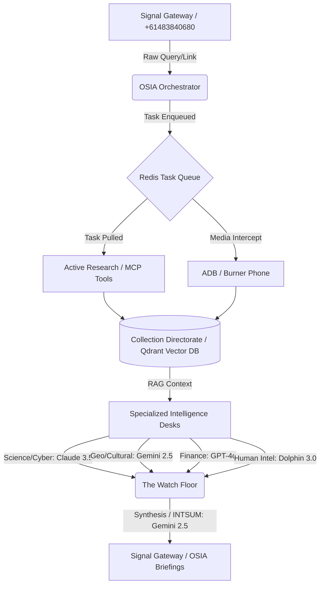

# OSIA Framework (Open Source Intelligence Agency)

An event-driven, multi-agent intelligence orchestration framework designed to automate the collection, analysis, and reporting of open-source intelligence. 

The framework mimics the organizational structure of a physical intelligence agency by breaking down the Intelligence Cycle into specialized AI Desks running on isolated models with unique analytical constraints.

---

## 🧠 Intelligence Lifecycle & Compounding RAG

OSIA is not a simple chatbot; it is a **living knowledge system**. Its intelligence follows a recursive cycle where every Request for Information (RFI) permanently strengthens the agency's collective memory.

### 1. The Collection Pipeline (Ingest)
When a query enters the system, the **Orchestrator (Chief of Staff)** doesn't just answer from its base training. It triggers a multi-stage collection process:
*   **Active Research:** Gemini calls specialized MCP tools (Wikipedia, ArXiv, Semantic Scholar, Tavily) to pull the latest factual data.
*   **Media Interception (PHINT):** If a social media link is provided, a physical Android device (via the ADB bridge) records the content to bypass bot detection, transcribing it via Gemini Vision.
*   **Raw Ingestion:** This "fresh" data is immediately pushed to the **Collection Directorate** workspace.

### 2. The Global Intelligence Pool (RAG)
All gathered intelligence is vectorized and stored in a **Qdrant** database under the `collection-directorate` namespace. 
*   **Persistent Memory:** Every desk (Cyber, Geopolitical, Finance, etc.) is configured to "read" from this shared pool.
*   **Compounding Nuance:** As the archives grow, the desks don't just see the "now." They perform vector searches that correlate current events with historical intercepts, academic papers, and previous briefings.
*   **Cross-Desk Synthesis:** Data collected by the Science Desk (e.g., a new drone patent) is automatically available to the Geopolitical Desk when analyzing regional conflicts.

### 3. Materialist Analysis (Output)
The final briefing is generated by a specialized desk applying the **Socialist Intelligence Mandate**. The result is a report that connects the economic "base" (extracted from RAG) to the political "superstructure," providing a level of depth that increases as the database expands.

---

## 🏛️ Organizational Structure (The Desks)

OSIA utilizes **AnythingLLM**'s isolated Workspaces to act as specialized "Desks". The **Orchestrator (Chief of Staff)** receives incoming tasks and routes them to the appropriate desk based on the intelligence required.

### 💼 Analytical Directorates
*   **Collection Directorate:** (Local NPU / `Pleias-RAG-350M`) - Pure data acquisition. Gathers raw data and transcripts via MCP tools.
*   **Geopolitical & Security Desk:** (Cloud / `gemini-2.5-flash`) - Analyzes statecraft, military capabilities, and international relations.
*   **Cultural & Theological Desk:** (Cloud / `gemini-2.5-flash`) - Examines sociological, religious, and philosophical drivers of conflict.
*   **Science & Tech Desk:** (Cloud / `claude-3-5-sonnet`) - Evaluates technical accuracy and engineering breakthroughs.
*   **Human Intelligence Desk:** (Local GPU / `dolphin3.0-llama3`) - Uncensored behavioral profiling and network mapping.
*   **Finance & Economics Desk:** (Cloud / `gpt-4o`) - Market dynamics, sanctions, and internal agency auditing.
*   **Cyber Intelligence & Warfare Desk:** (Cloud / `claude-3-5-sonnet`) - Specialized analysis of nation-state cyber operations, digital sovereignty, and global cyber-crime.
*   **The Watch Floor:** (Cloud / `gemini-2.5-flash`) - Synthesis of multi-desk reports into final **INTSUM** (Intelligence Summary) documents.

---

## 📡 System Architecture

OSIA is built on a decoupled, microservice-based architecture centered around a **Redis Task Queue**.

### 1. Ingress (Input)
*   **Signal Gateway:** A cryptographically secure entry point using a physical Android burner phone (+61483840680) acting as a "Ghost Persona".
*   **ADB Media Pipeline:** A physical Moto g06 connected via USB. The framework uses ADB to physically "watch" social media (Instagram, TikTok, FB), record the screen, and use Gemini Vision to extract intelligence from video without triggering bot detection.

### 2. Orchestration (The Brain)
*   **OSIA Orchestrator:** A Python-based daemon that manages the lifecycle of an intelligence task, from initial Signal receipt to final report delivery.
*   **Model Tiering:** Tasks are balanced between local **NPU** (low power), local **RTX GPU** (private/uncensored), and **Cloud LLMs** (high reasoning).

### 3. Storage (The Archives)
*   **Qdrant:** High-performance vector database storing all intercepted intelligence and departmental context.

### 4. Egress (Output)
*   **Automated Reporting:** Finished intelligence reports are automatically messaged back to the original requester via Signal.

---

## 🛠️ Tech Stack
- **Hardware:** Orange Pi 5 Plus (ARM64), Moto g06 (Android Gateway), RTX 3080 Ti (Local Compute).
- **Software:** Linux, Python 3.12 (`uv`), Docker, Redis.
- **Intelligence:** Google Gemini 2.5, OpenAI GPT-4o, Llama 3.1, Dolphin 3.0.
- **Protocol:** Signal (E2EE), ADB, AnythingLLM API, Qdrant.
